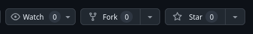
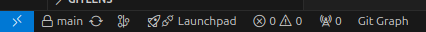
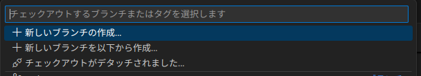
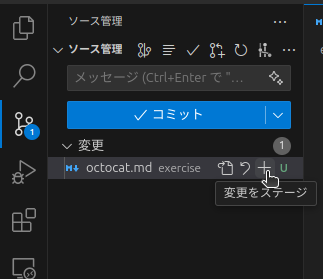
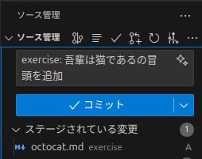
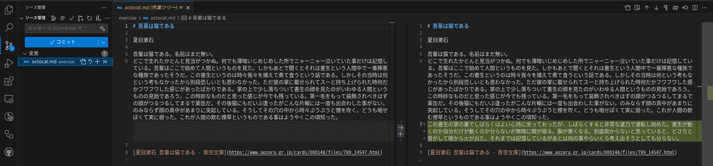
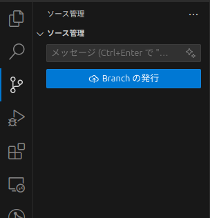
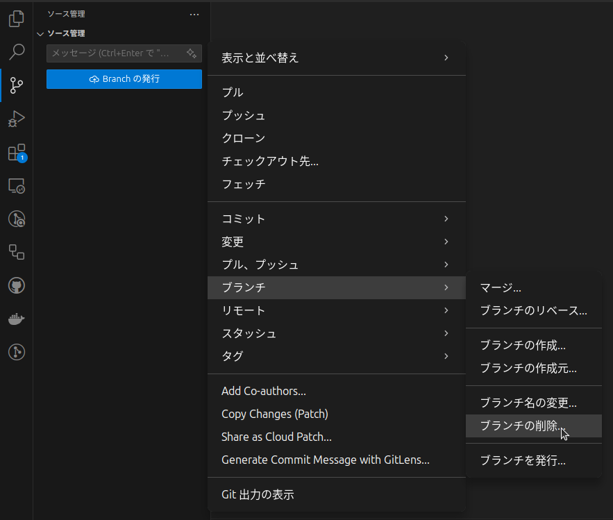

import { Steps } from "@astrojs/starlight/components";
import { FileTree } from "@astrojs/starlight/components";

この演習では、[tpu-dsg/git-hands-on](https://github.com/tpu-dsg/git-hands-on)に対してPull Requestを作成します。

この演習を通して、以下のことを学びます。

- GitやGitHubの基本的な操作
- Pull Requestを使用した、GitHubにおける共同開発の流れ

## リポジトリをフォーク

まずは、[tpu-dsg/git-hands-on](https://github.com/tpu-dsg/git-hands-on)をフォークしましょう。

[フォーク](https://docs.github.com/ja/pull-requests/collaborating-with-pull-requests/working-with-forks/fork-a-repo)は他のユーザーのリポジトリを自分のアカウントにコピーすることです。自分が書き込み権限を持たないリポジトリに対して変更を提案するには、フォークする必要があります。

<Steps>
  1. [tpu-dsg/git-hands-on](https://github.com/tpu-dsg/git-hands-on)にアクセスします。
  2. ページ右上の「Fork」ボタンをクリックします。
   
  3. `Create fork`ボタンをクリックします。
</Steps>

## リポジトリをクローン

次に、フォークしたリポジトリをローカルにクローンしましょう。クローンとは、リモートリポジトリをローカルにコピーすることです。

<Steps>
1. フォークした**自分の**リポジトリの「Code」ボタンをクリックします。
2. `HTTPS`を選択し、表示されているURLをコピーします。（SSHでセットアップを行っている場合は`SSH`を選択します。）
3. リポジトリのファイルを置きたい場所でターミナルを開くか、コマンドを使用して移動します。
   ```bash
   # 例: "dsg"ディレクトリを作成し移動する場合
   mkdir dsg
   cd dsg
   ```
4. `git clone`コマンドを使用してリポジトリをクローンします。`<URL>`には先ほどコピーしたURLを貼り付けます。
   ```bash
   git clone <URL>
   ```
   ```bash
   cd git-hands-on
   ```
</Steps>

:::note
この先の操作は、VSCodeなどのGit操作が可能なエディタを使用することもできます。以下のコマンドでターミナルからVSCodeを起動できます。

```bash
code . # 現在のディレクトリをVSCodeで開く
```

:::

## ブランチを作成

次に、作業用のブランチを作成しましょう。ブランチを作成することで他の作業との競合を避けることができます。

以下のコマンドを使用して、`main`ブランチから新しいブランチ「`exercise`」を作成し切り替えます。

```bash
git checkout -b exercise
```

VSCodeでは、左下の「main」（現在のブランチ名）をクリックして「新しいブランチの作成」を選択します。そしてブランチ名「`exercise`」を入力することでブランチを作成できます。





:::tip
実際の開発では、作業内容に応じたブランチ名を使用するべきでしょう。例えば、`feature/`や`fix/`といったプレフィックスをつけると、作業内容を明確にできます。
:::

あなたは現在、`exercise`ブランチにいます。コマンドを使って確認してみましょう。

```bash
git branch
# 以下のように表示されているはずです
# * exercise
#   main
```

## ファイルを追加

次に、このリポジトリに新しいファイルを追加しましょう。

`exercise/`ディレクトリに`<GitHubユーザーID>.md`を作成します。例えば、[The Octocatさん](https://github.com/octocat)の場合は`octocat.md`となります。

<FileTree>
  - .github/ 
  - docs/ 
  - exercise/ 
    - **ユーザーID.md** 作成するファイル 
  - LICENSE
  - README.md 
  - ...
</FileTree>

作成したMarkdownファイルに、なにか内容を追加してみましょう。良い案が思いつかないなら、以下のような内容を追加してみてください。

```markdown title="<ユーザーID>.md"
# 吾輩は猫である

夏目漱石

吾輩は猫である。名前はまだ無い。
どこで生れたかとんと見当がつかぬ。何でも薄暗いじめじめした所でニャーニャー泣いていた事だけは記憶している。吾輩はここで始めて人間というものを見た。しかもあとで聞くとそれは書生という人間中で一番獰悪な種族であったそうだ。この書生というのは時々我々を捕えて煮て食うという話である。しかしその当時は何という考もなかったから別段恐しいとも思わなかった。ただ彼の掌に載せられてスーと持ち上げられた時何だかフワフワした感じがあったばかりである。掌の上で少し落ちついて書生の顔を見たのがいわゆる人間というものの見始であろう。この時妙なものだと思った感じが今でも残っている。第一毛をもって装飾されべきはずの顔がつるつるしてまるで薬缶だ。その後猫にもだいぶ逢ったがこんな片輪には一度も出会わした事がない。のみならず顔の真中があまりに突起している。そうしてその穴の中から時々ぷうぷうと煙を吹く。どうも咽せぽくて実に弱った。これが人間の飲む煙草というものである事はようやくこの頃知った。

[夏目漱石 吾輩は猫である - 青空文庫](https://www.aozora.gr.jp/cards/000148/files/789_14547.html)
```

:::tip
Markdown記法はソフトウェアエンジニアなどがよく使用する文書フォーマットです。
:::

## 変更をコミット

次に、作成したファイルをコミットしましょう。コミットとは変更を記録することです。これにより任意のコミット時の状態に戻すことができるようになります。

まず、コミットするファイルをステージングします。これはどの変更をコミットするかを指定する作業です。ここでは扱いませんが、行ごとに変更をステージングすることもできます。

```bash
git add exercise/<ユーザー名>.md
# または変更したファイルすべてをステージングする
git add .
```

VSCodeでは、ソース管理パネルから変更をステージングできます。



次に、コミットメッセージをつけ、ステージングした変更をコミットします。今回は先頭に`exercise: `をつけることを必須とします。コミットメッセージは**変更内容を簡潔に表すものであるべき**です。

```bash
git commit -m "exercise: 吾輩は猫であるの冒頭を追加"
```

VSCodeでは、以下のようにコミットメッセージを入力してコミットできます。



:::tip
作業内容を明確にするために、コミットメッセージの書式を定める場合があります。代表的なものに[Conventional Commits](https://www.conventionalcommits.org/ja/v1.0.0/)があります。
:::

## さらに変更を加える

次に、作成したファイルにさらに変更を加えてみましょう。先ほど「[吾輩は猫である](https://www.aozora.gr.jp/cards/000148/files/789_14547.html)」を追加した場合は、その続きを追加してみてください。

```markdown title="<ユーザーID>.md" ins={7}
# 吾輩は猫である

夏目漱石

吾輩は猫である。名前はまだ無い。
どこで生れたかとんと見当がつかぬ。何でも薄暗いじめじめした所でニャーニャー泣いていた事だけは記憶している。吾輩はここで始めて人間というものを見た。しかもあとで聞くとそれは書生という人間中で一番獰悪な種族であったそうだ。この書生というのは時々我々を捕えて煮て食うという話である。しかしその当時は何という考もなかったから別段恐しいとも思わなかった。ただ彼の掌に載せられてスーと持ち上げられた時何だかフワフワした感じがあったばかりである。掌の上で少し落ちついて書生の顔を見たのがいわゆる人間というものの見始であろう。この時妙なものだと思った感じが今でも残っている。第一毛をもって装飾されべきはずの顔がつるつるしてまるで薬缶だ。その後猫にもだいぶ逢ったがこんな片輪には一度も出会わした事がない。のみならず顔の真中があまりに突起している。そうしてその穴の中から時々ぷうぷうと煙を吹く。どうも咽せぽくて実に弱った。これが人間の飲む煙草というものである事はようやくこの頃知った。
この書生の掌の裏でしばらくはよい心持に坐っておったが、しばらくすると非常な速力で運転し始めた。書生が動くのか自分だけが動くのか分らないが無暗に眼が廻る。胸が悪くなる。到底助からないと思っていると、どさりと音がして眼から火が出た。それまでは記憶しているがあとは何の事やらいくら考え出そうとしても分らない。

[夏目漱石 吾輩は猫である - 青空文庫](https://www.aozora.gr.jp/cards/000148/files/789_14547.html)
```

先ほどのコミットからの変更点を確認してみましょう。

```bash
git diff
```

VSCodeでは、ソース管理パネルから変更点を確認できます。



では、先ほどと同様にステージングしてコミットしてみましょう。

```bash
git add exercise/<ユーザー名>.md
git commit -m "exercise: 吾輩は猫であるの第三段落を追加"
```

:::tip
このとき、「ファイル内容を変更」のようなコミットメッセージは避けたほうがいいでしょう。変更を加えたときにしかコミットしないので、このメッセージには有用な情報がありません😇
:::

## リモートリポジトリにプッシュ

次に、ローカルリポジトリの変更をリモートリポジトリにプッシュしましょう。プッシュとは、ローカルリポジトリの変更をリモートリポジトリに反映させることです。

```bash
git push origin exercise
```

VSCodeでは、ソース管理パネルの「Branchの発行」をクリックしてプッシュできます。



## Pull Requestを作成

最後に、フォーク元のリポジトリに対してPull Requestを作成しましょう。Pull Requestとは、変更を取り込んでもらうためのリクエストです。取り込んでもらう前にレビューを受けることができます。

<Steps>
  1. 自分のGitHubリポジトリのページにアクセスします。 
  2. 「Compare & pull request」ボタンをクリックします。 
  3. 変更内容を記載し、「Create pull request」ボタンをクリックします。
</Steps>

Pull Requestが作成されると、リポジトリのメンテナーがレビューを行い、変更を取り込むかどうかを決定します。

:::note
フォーク元へのPull Requestは、個人開発やチーム開発におけるPull Requestのバリエーションだと考えることができます。
自分が書き込み権限を持つリポジトリの場合は、同じリポジトリのブランチから`main`ブランチに対してPull Requestを作成します。
:::

## マージされたら

マージされたら元のリポジトリに変更が反映されます。おめでとうございます！🎉

不要なブランチは削除しておきましょう。

```bash
git checkout main
git branch -D exercise
```

VSCodeでは、「ソース管理」横のミートボールメニューからブランチを削除できます。


