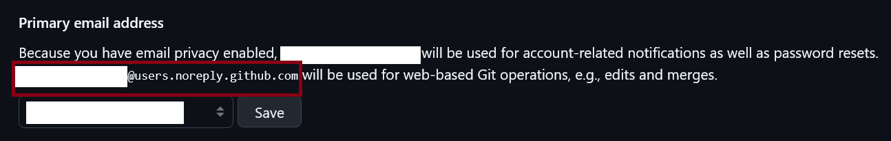

import { Steps } from "@astrojs/starlight/components";

Gitでコミットする前に、E-mailアドレスと名前の設定が必要です。名前やメールアドレスが未設定のままコミットをしようとすると、以下のようなエラーが発生します。

```bash
*** Please tell me who you are.

Run

  git config --global user.email "you@example.com"
  git config --global user.name "Your Name"

to set your account's default identity.
Omit --global to set the identity only in this repository.
```

親切なエラーメッセージの通り、以下のように設定を行います。

## E-mailアドレスの設定

メールアドレスを設定します。このメールアドレスはコミットを通して**公開される**ので、こだわりがある場合を除いて、GitHubが提供する`noreply`メールアドレスを使用するといいでしょう。
`noreply`メールアドレスは以下の手順で確認できます。

<Steps>
1. GitHubにログインする
2. 右上のアイコンをクリックし、`Settings`を選択
3. 左の`Emails`を選択
4. 「Primary email address」内に、`<番号>+<ユーザーID>@users.noreply.github.com`の形式で小さく表示されているのでコピーする
  
</Steps>

コピーできたら、以下のコマンドでメールアドレスを設定します。

```bash
git config --global user.email "メールアドレス"
```

:::caution
実在しないアドレスなど、テキトーなものは設定すべきではありません。
:::

## 名前の設定

以下のコマンドでコミットに記録される名前を設定します。アルファベットを使用してください。

```bash
git config --global user.name "名前"
```
