import { Steps } from "@astrojs/starlight/components";

Windows環境へのインストール方法を紹介します。

:::note
[Windows Subsystem for Linux(WSL)](https://learn.microsoft.com/ja-jp/windows/wsl/about)でGitを使用する場合は、[Linux](../linux)を参照してください
:::

## Git for Windowsのインストール

[Git for Windowsの公式サイト](https://gitforwindows.org/)からインストーラーをダウンロードして実行します。

<Steps>

1. ライセンスを読み、同意します。
   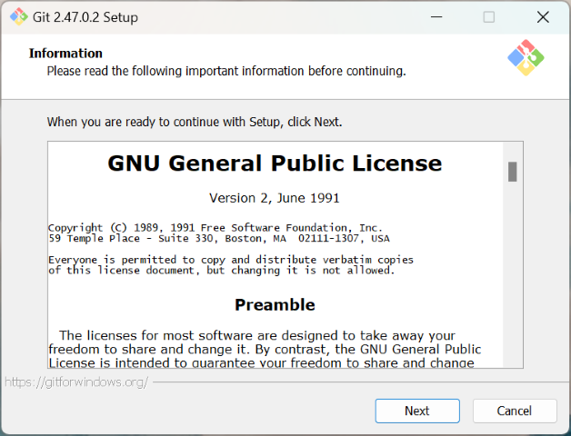
2. インストール先を選択します。デフォルトのままで問題ありません。
   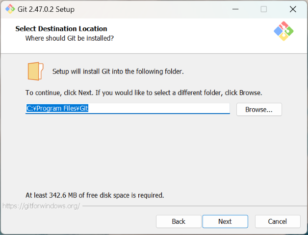
3. コンポーネントの選択画面では、こだわりがなければ以下のように選択します。
   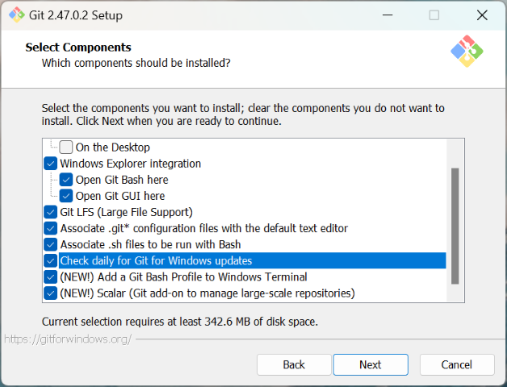
4. スタートメニューのフォルダを選択します。デフォルトのままで問題ありません。
   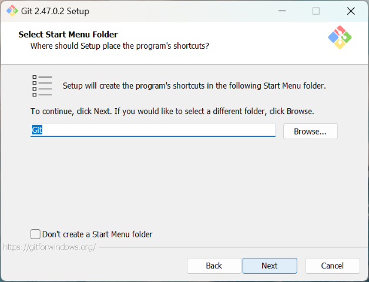
5. エディタの選択画面では、普段使用しているエディタを選択します。VSCodeを推奨します。
   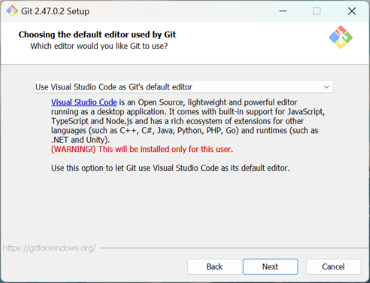
6. ブランチの名前はオーバーライドし、`main`に変更します。（`master`はセンシティブな用語だとみなされており、[置き換える動き](https://www.publickey1.jp/blog/20/githubmainmastermain.html)があります。）
   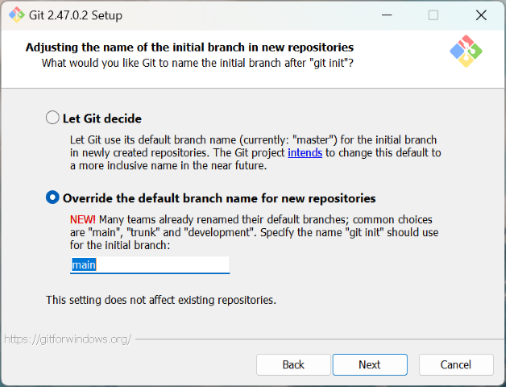
7. PATHの設定は、推奨されている設定を選択します。
   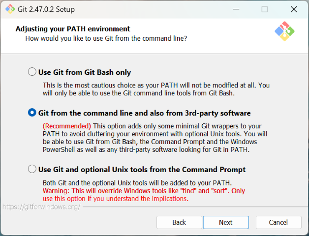
8. SSHの選択画面では、バンドルされているOpenSSHを選択します。
   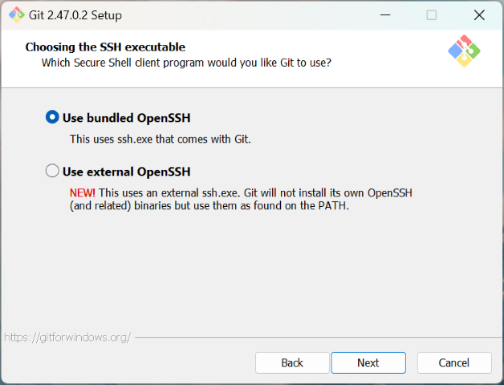
9. HTTPSバックエンドの選択画面では、OpenSSLを選択します。
   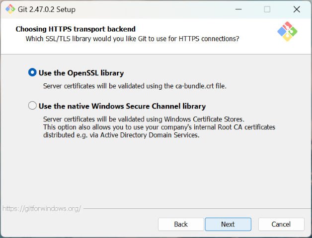
10. line-endingの選択画面では、以下のように選択します。
    
11. ターミナルの選択画面では、MinTTYを選択します。
    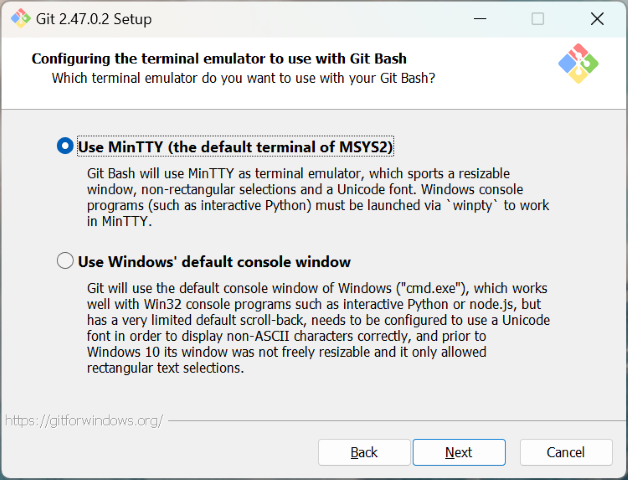
12. `git pull`動作の選択画面では、以下のように選択します。
    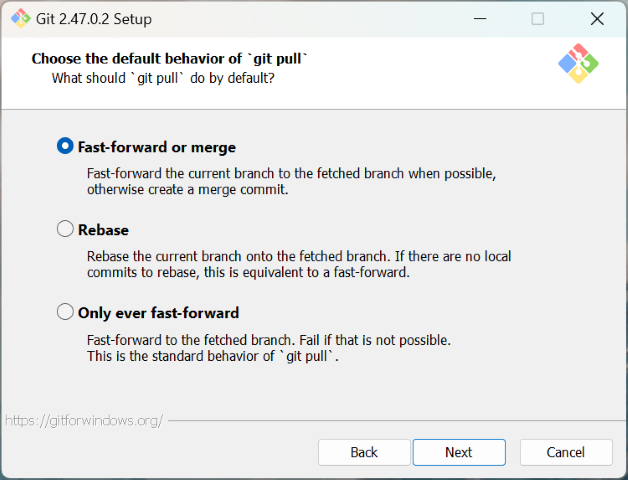
13. credential helperの選択画面では、以下のように選択します。
    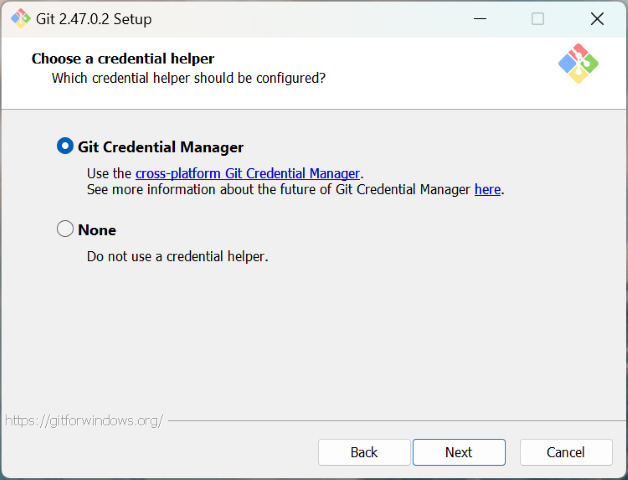
14. extraの選択画面では、以下のように選択します。
    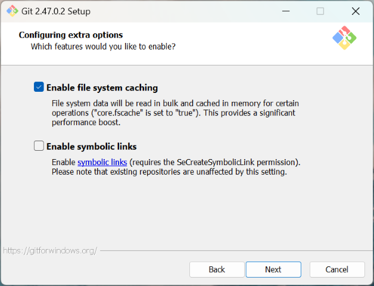
15. インストールを開始します。
    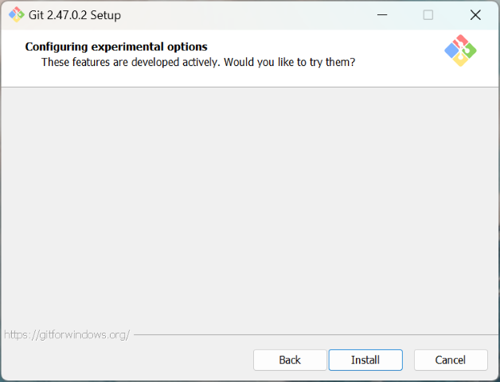

</Steps>
